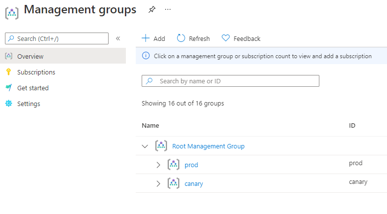

# Samples

## Multiple-Environment

The Multiple-Environment sample demonstrates how to use AzOps where segregation between management groups is required.
This approach would fit where there are two Enterprise Scale reference implementations (canary and production).

This is most suited to enterprises with *robust change management processes* governing changes to the production management group hierarchy. The Canary environment can be independently used to author and test deployments before taking the same Arm templates into the Production environment.

### Changes

The key changes over the core AzOps Accelerator pipelines are;

1. Two sets of Push and Pull pipelines 
1. Use of [Azure DevOps templates](https://docs.microsoft.com/en-us/azure/devops/pipelines/process/templates?view=azure-devops) to eliminate duplication of code between the pipelines
1. Two Variable Groups, using different credentials
1. Two configuration files for each pair of pipelines
1. Partial Management Group Discovery to respect the scoped access the credentials have
1. Two sets of branches used to capture changes from each of the environments
1. Two root folders used in repository with custom naming
1. Introduction of Pipeline Environments to enable Environment Approvers

### Sample project

An example of the Multiple-Environment sample is hosted in a [Public Azure Project](https://dev.azure.com/mscet/CAE-AzOps-MultiEnv), this can be a good reference point for when you're implementing this sample.
|Canary Pull | Canary Push  | Prod Pull | Prod Push |
--- | --- | --- | ---
|||||

### Implementation Notes

#### Service Principals

It's advised to use different Service Principals to access each environment. Each Service Principal will need Owner access for just the Management Group scope it needs to augment change in. These would be stored in two different Variable Groups, named according to the environment (AZURECREDENTIALS_CANARY and AZURECREDENTIALS_PROD).

#### Environment names

The terms Canary and Prod are embedded throughout the sample files. Where your Reference Implementation Prefix is different, these replacements will need to be made.
